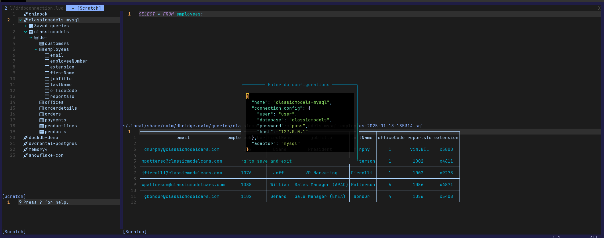

# DBridge.nvim

A neovim plugin for [dbridge](https://github.com/e3oroush/dbridge) to interact with different databases inside neovim using [nui.nvim](https://github.com/MunifTanjim/nui.nvim).



## Table of contents

- [Installation](#installation)
- [Usage](#usage)
- [License](#license)

## Installation

**requires nvim>=0.10**

You should also make sure to install [dbridge](https://github.com/e3oroush/dbridge) server app and run it.

- packer.nvim:

  ```lua
  use {
    "e3oroush/dbridge.nvim",
    requires = {
      "MunifTanjim/nui.nvim",
    },
    config = function()
      require("dbridge").setup()
    end
  }
  ```

- lazy.nvim:

  ```lua
  {
    "e3oroush/dbridge.nvim",
    dependencies = {
      "MunifTanjim/nui.nvim",
    },
    config = function()
      require("dbee").setup()
    end,
  },
  ```

## Usage

To start the DBridge UI, write the command `:Dbxplore` and it will open a new tab that you can add a new db connection. To go back and forth between the current tab and DBridge tab, you might want to use default `gt` to swtich the tab, or run the command `:Dbxplore` again to hide it.

You can use the following keybindings on the dbexplorer tree:

- Press `a` to add a new connection
- Press `Enter` to open a connection/database/schema/table
- Press `e` on 󱘖 connection node to edit a connection
- Press `DD` on a 󱘖 connection/ saved query to delete them
- Press `R` on a 󱘖 connection/ database/ table to refresh the data
- Press `l` and `h` to expand and collapse any node

The following keybindings are for the other two panels:

- Press `<leader>r` to run a query on the query panel
- Press `n` and `p` to get the next and previous page of data on the query result panel.

### Specifying a connection

Any database connection has its own set of configurations. DBridge is quite flexible to support any number of complicated configurations in json key-values.  
The database should be supported by [dbridge](https://github.com/e3oroush/dbridge), for example to connect to a mysql adapter:

```json
{
  "name": "classicmodels-mysql",
  "connection_config": {
    "user": "user",
    "database": "classicmodels",
    "password": "pass",
    "host": "127.0.0.1"
  },
  "adapter": "mysql"
}
```

## License

`dbridge.nvim` is distributed under the terms of the [MIT](https://spdx.org/licenses/MIT.html) license.
